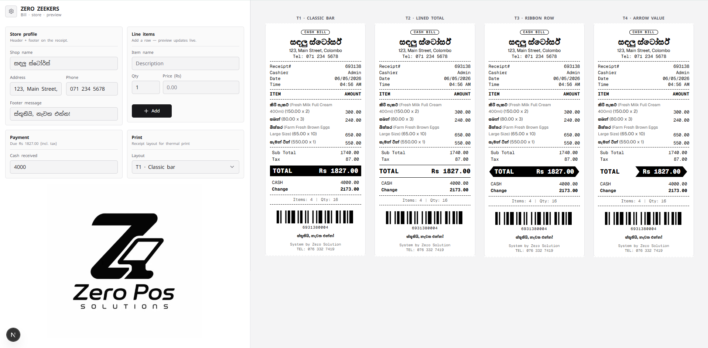

# ZERO ZEEKERS

Thermal receipt preview and print layout tooling: edit store profile, line items, and payments on the left while four receipt variants update live.

<p align="center">
  
</p>

---

## Highlights

| Area | Description |
|------|---------------|
| **Layouts** | Four templates (classic bar, lined total, full-row ribbon, value arrow ribbon). |
| **Print** | Browser print targeting 80 mm thermal strip styling. |
| **Web UI** | Fixed settings column, Sinhala-friendly typography (Noto Sans Sinhala). |

Receipt footer branding stays independent of the web app chrome (configured in bill components / shop fields).

---

## Stack

Next.js App Router (**16.x**), React **19**, TypeScript, Tailwind CSS **v4**.

---

## Commands

```bash
npm install
npm run dev
npm run build
npm start
npm run lint
```

Local app: **http://localhost:3000**

---

## Repo map

| Path | Role |
|------|------|
| `app/` | Routes, layout metadata, globals |
| `features/billing/billing-app.tsx` | Shell: settings + print pipeline |
| `components/billing/` | Receipt JSX, previews, layout picker |
| `data/mock-billing.ts` | Demo shop/items |
| `public/` | Static assets (`image.png`, `logo.jpeg`) |
